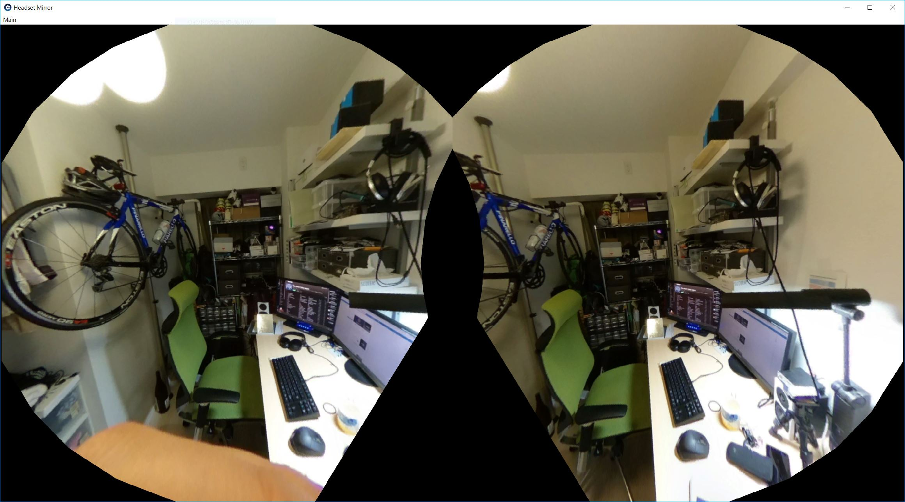

## TWO THETA STEREO TEST

* 眼間距離だけ離して撮影した2つの360度カメラ映像を用いて，HMDで両眼立体視をしてみるテスト．
  * 今のところ撮影済の静止画2枚で行っているけど，動画に変えることも可能．
* 正しい目の位置関係になっているのは，正面を向いたときだけ．
  * 首を回転させると破綻するけど，案外上下左右45度ずつくらいなら許容範囲．
  * 今のサンプル画像のまま後ろを向くと，自分の顔が映っている…というのはさておき，両目の左右関係が反転するので対処が必要．