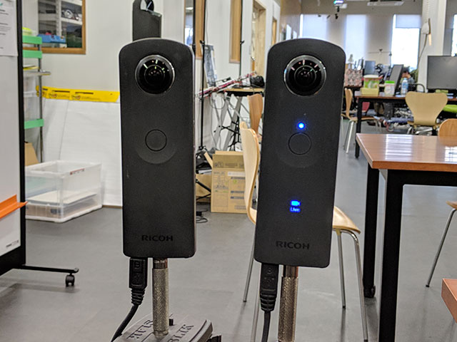
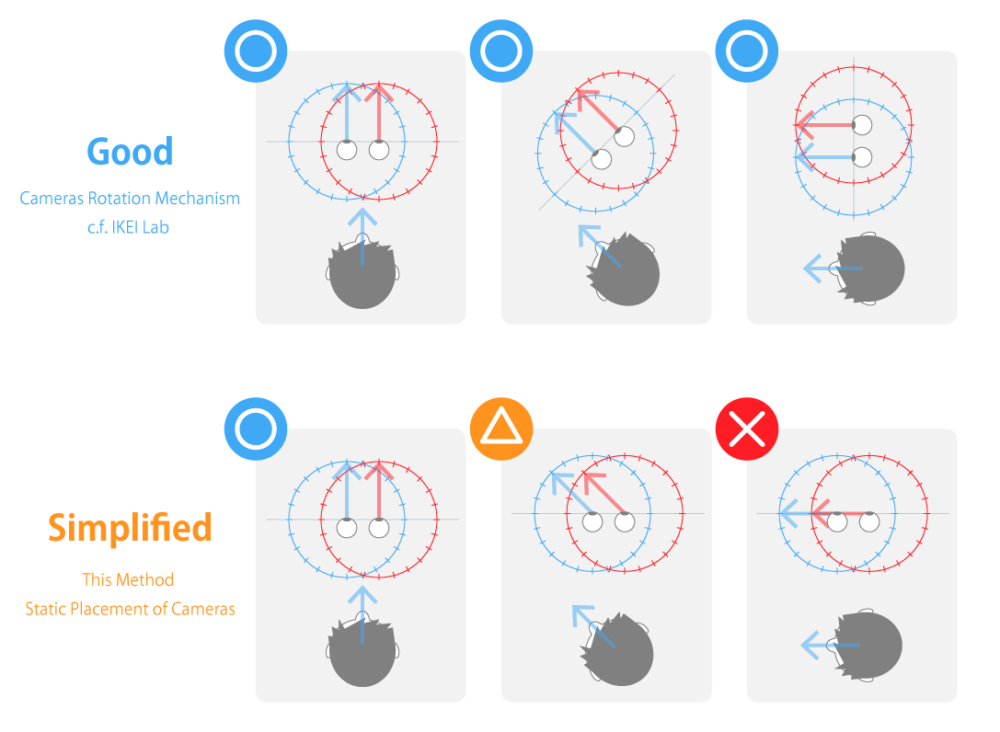

## TWO THETA STEREO TEST

## OVERVIEW

眼間距離だけ離して撮影した2つの360度カメラ映像を用いて、HMDで両眼立体視をしてみるテスト。

### SCENES

* TwoThetaStereo -> 静止画2枚を用意して行う
* TwoThetaSStereoLive -> Theta S 2機でリアルタイムに行う。

## SETUP

### Environment

* Windows 10 x64
* Unity 2018.1.6f1
* Player Configuration
  * .NET 3.5 Equivalent
  * Mono
  * .NET 2.0 Subset
* Visual Studio 2017 Community
* VR: OpenVR - SteamVR 依存コードはない。すべてUnity標準のXRの書き方になっている。

### TwoThetaSStereoLive

* `Sphere100L` `Sphere100R` の WebCamDrawer.cs に、利用するカメラを指定する。 THETA S が二つWindowsに刺さっている場合、 `RICOH THETA S` `RICOH THETA S 1` などと指定すると良いはず。
* 高さと眼間距離は、カメラ設置で極力頑張る
* 微妙な回転は、Unity 内 Sphere100L, Sphere100R の回転で相殺する。

## LIMITATION

* 正しい目の位置関係になっているのは、正面を向いたときだけ。
  * 首を回転させると破綻するけど、案外上下左右45度ずつくらいなら許容範囲。
  * 今のサンプル画像のまま後ろを向くと、自分の顔が映っている…というのはさておき、両目の左右関係が反転するので対処が必要。
* 2つのカメラを回転させる機構を入れると破綻しない。 
  * c.f. ステレオカメラの首振り
  または[首都大池井研 TWINCAM](https://youtu.be/nQYtTEzJQGk)方式)

